# Pavun Kumar R

### AI Engineer — Agents · Voice AI · RAG Systems

---

## About Me

AI engineer with **1.5+ years shipping production agentic systems** — multi-agent RAG, MCP servers, multilingual voice agents, and document-AI validation — for real clients across India and Europe. Promoted **twice in 16 months** (intern → junior → associate) while completing a CS degree.

**What I've shipped:**

| Metric | Result |
|---|---|
| ⚡ Retrieval latency reduction | **42%** |
| 🚀 Release cycle improvement | **3 days → 6 hours** |
| 📄 Document verification time | **2 hours → 5 minutes** |
| 📊 Document queries served/week | **8,000+** |
| 🔗 Production AI systems shipped | **6+ in 18 months** |

Previously remote with a Germany-based legal-tech startup. AI-native builder with **Cursor** and **Claude Code**. Active open-source contributor.

---

## Experience

### 🏢 Associate Innovation Developer (AI) · ThoughtSeed, Bangalore *(Jul 2025 – Present)*

- Architected production **multi-agent RAG systems** (LangChain, Agno) serving 8,000+ document queries/week at sub-2s response — improved retrieval accuracy **38%** over keyword search via optimized embeddings and semantic ranking
- Designed and deployed **Model Context Protocol (MCP) servers** connecting AI agents to 5+ external tools and APIs — cut agent integration setup time **65%**
- Automated AI microservice deployments (Docker, GitHub Actions, GCP) — release cycle from 3 days to **under 6 hours**, 99.4% deployment success rate
- Took **4 AI products from prototype to production** with cross-functional teams, lifting sprint velocity 28% through AI-assisted development workflows

### 🧩 Junior Innovation Developer · ThoughtSeed, Bangalore *(Mar 2025 – Jul 2025)*

- Built AI document-processing and semantic-search pipelines that cut unstructured data retrieval time **52%** versus manual extraction
- Developed enrichment pipelines processing **30,000+ records/week** into downstream AI retrieval and classification systems
- Shipped 3 cloud-native features end-to-end, reducing time-to-deploy **45%**

### 🛠️ Full Stack Developer Intern · ThoughtSeed, Remote *(Dec 2024 – Mar 2025)*

- Built REST services (Node.js, Express, PostgreSQL) for 3 client-facing apps; query indexing improved DB response time **30%**
- Containerized 4 services with automated pipelines, cutting environment bugs **40%**

### ⚖️ AI & Data Engineer Intern · WhatsLegal.ai, Remote (Germany) *(Sep 2024 – Dec 2024)*

- Built a **legal document Q&A system** (LangChain, semantic retrieval) over **100,000+ Indian court judgments**, reaching 85% answer relevance on internal evaluation benchmarks
- Engineered NLP pipelines extracting case metadata (parties, dates, rulings, citations) — reduced manual legal research time **~60%**
- Automated ingestion cut batch onboarding from **4 hours to 30 minutes**

---

## Featured Projects

### 🎙️ [SNOVA — Multilingual Voice Admission Agent](https://snova-sethu.vercel.app)
> Tamil + English voice agent for college admissions · Next.js · Live

Built and deployed a voice agent for a Tamil Nadu engineering college that answers all department and college queries and guides students through admission and counseling step by step.

- 🗣️ Fully bilingual: **Tamil + English**
- 📉 Reduced manual counselor workload by **50%**
- ⚡ Real-time voice with dynamic conversation flow

**Stack:** Vapi · OpenAI · Next.js · Natural Language Routing

---

### 📋 [iVerif — AI Document Validation for Energy Subsidies](https://iverif.fr)
> Document AI · PDF Pipelines · Live in France

French energy subsidy claims require verifying **100+ rules across 5+ documents per claim** — previously done manually. Built an AI validation system that extracts and cross-checks document fields automatically.

- ⏱️ Verification time: **2 hours → 5 minutes** per claim
- 📑 Handles complex multi-document, multi-rule validation at scale
- 🇫🇷 Live production system used by energy installers and companies

**Stack:** Python · FastAPI · PDF Pipelines · Document AI · LangChain

---

### 📲 [Instagram Auto-Reply — Open-Source ManyChat Alternative](https://github.com/Pavun57)
> Composio · Zernio · Open Source

Open-source Instagram comment and DM automation that replaces the ManyChat premium plan — runs entirely on the user's own API keys.

- 💰 Cost: **$20/month → $0**
- 🔓 Fully open-source and self-hosted
- ⚙️ Powered by Composio and Zernio

**Stack:** Composio · Zernio · Instagram Graph API · Node.js

---

## Tech Stack

### Agentic AI

### Voice AI

### Backend

### Frontend

### Cloud & DevOps

### AI-Native Workflow & Automation

---

## Achievements & Open Source

🏆 **Smart India Hackathon 2024 — Finalist**, Legal Technology track — selected among **200+ teams** for a semantic search platform over 100,000+ legal judgments

🔓 **Open-source builder** — Triage AI (VS Code agent assistant) and an open-source ManyChat alternative for Instagram automation

🚢 **Shipped 6+ production AI systems** across legal-tech, education, document validation, voice AI, and automation within 18 months of professional experience

📈 **Promoted twice in 16 months** — Intern → Junior Developer → Associate Developer while studying full-time

---

## GitHub Stats

> ⚙️ **Setup required:** These cards are generated by a GitHub Action in your profile repo and stored as static SVGs — they never go down. See the `stats.yml` workflow file included with this README. Run it once manually from the Actions tab to generate the images.

---

## Education

**B.E. Computer Science and Design** · Sethu Institute of Technology, Tamil Nadu *(2023 – 2027, expected)*  
Working full-time in AI engineering alongside the degree since second year.

---

*Open to remote roles worldwide · UTC+5:30*

